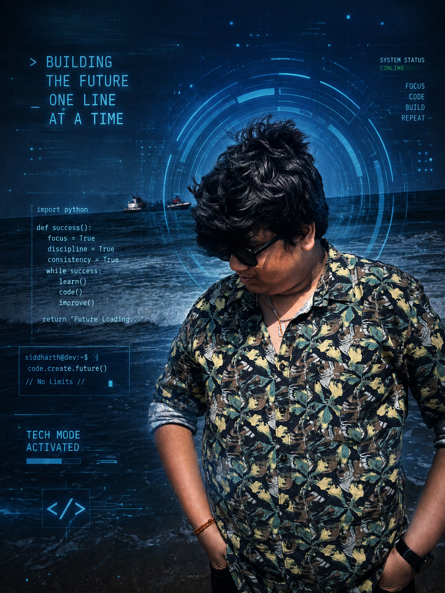

<!-- ======================= HEADER ======================= -->

<h1 align="center">
  
   
  Hi 👋, I'm Naveen Vinayak Desai
</h1>

<h3 align="center">
  💻 Aspiring Web Developer | 🚀 Building the Web | 🌱 Always Learning
</h3>

  
  

---

## 👨‍💻 About Me

Hello! I'm **Naveen Vinayak Desai**, an aspiring **Web Developer** passionate about building modern, responsive, and user-friendly web applications.

I enjoy transforming ideas into real-world projects and continuously improving my programming and development skills.

- 💻 Passionate about **Web Development**
- 🌱 Currently learning and improving my development skills
- 🚀 Interested in building **real-world applications**
- 🎯 Working towards becoming a **professional Full-Stack Developer**
- 🧠 I believe in **learning by building**
- 🤝 Open to collaboration and exciting development opportunities
- 📚 Always curious to learn new technologies

---

## 🛠️ Tech Stack

### 🌐 Frontend Development

  

### ⚙️ Backend Development

  

### 🗄️ Databases

  

### 🔧 Tools & Technologies

  

> 🚀 My technology stack is continuously growing as I learn and build new projects.

---

## 🚀 What I'm Working On

I'm currently focused on improving my skills in:

- 🌐 Responsive Web Design
- ⚡ JavaScript & Modern Web Development
- ⚛️ React Development
- 🔧 Backend Development
- 🔗 REST APIs
- 🗄️ Database Management
- 🔐 Authentication & Authorization
- 🚀 Full-Stack Web Applications

---

## 📌 Featured Projects

### 🌐 Web Development Projects

I'm building projects to gain practical experience and solve real-world problems.

Some of the areas I'm exploring:

- 🖥️ Responsive Websites
- ⚛️ React Applications
- 🔗 REST API Integration
- 🔐 Authentication Systems
- 🗄️ Database Applications
- 🚀 Full-Stack Applications

> 🚧 More exciting projects coming soon!

---

## 📊 GitHub Statistics

  

  

---

## 🔥 GitHub Streak

  

---

## 📈 GitHub Activity

  

---

## 🎯 2026 Goals

- 🚀 Become a skilled professional Web Developer
- 📚 Master JavaScript and modern web technologies
- ⚛️ Build advanced React applications
- 🔧 Improve backend development skills
- 🗄️ Gain deeper knowledge of databases
- 🌍 Build and deploy production-ready applications
- 🤝 Contribute to open-source projects
- 💼 Prepare for opportunities in the software industry

---

## 💡 Developer Philosophy

> **"Don't just learn to code. Build, break, fix, and learn."**

I believe that becoming a great developer isn't just about knowing programming languages.

It's about **building projects, solving problems, making mistakes, learning from them, and continuously improving.**

---

## 🤝 Connect With Me

  

  

  📱 <b>Phone:</b> +91 79814 34815

---

## 👀 Profile Visitors

  

---

<h3 align="center">
  ⭐ Thanks for visiting my profile!
</h3>

  <i>Let's build something amazing together 🚀</i>

  💻 Code • 🚀 Build • 📚 Learn • 🔥 Repeat

